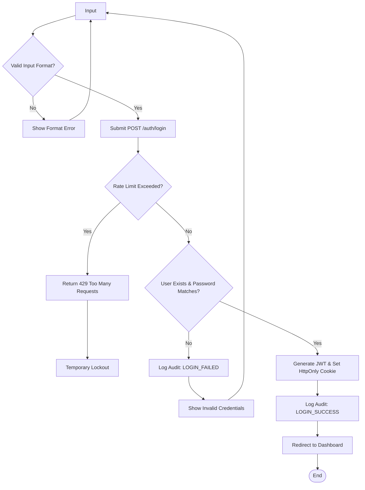

```mermaid
flowchart TD
    Input --> Validate{Valid Input Format?}
    
    Validate -- No --> ErrFormat[Show Format Error]
    ErrFormat --> Input
    
    Validate -- Yes --> Submit[Submit POST /auth/login]
    Submit --> RateCheck{Rate Limit Exceeded?}
    
    RateCheck -- Yes --> ErrRate[Return 429 Too Many Requests]
    ErrRate --> Lockout[Temporary Lockout]
    
    RateCheck -- No --> DBCheck{User Exists & Password Matches?}
    
    DBCheck -- No --> AuditFail[Log Audit: LOGIN_FAILED]
    AuditFail --> ErrAuth[Show Invalid Credentials]
    ErrAuth --> Input
    
    DBCheck -- Yes --> GenCookie[Generate JWT & Set HttpOnly Cookie]
    GenCookie --> AuditSuccess[Log Audit: LOGIN_SUCCESS]
    AuditSuccess --> Redirect[Redirect to Dashboard]
    Redirect --> End([End])
```

