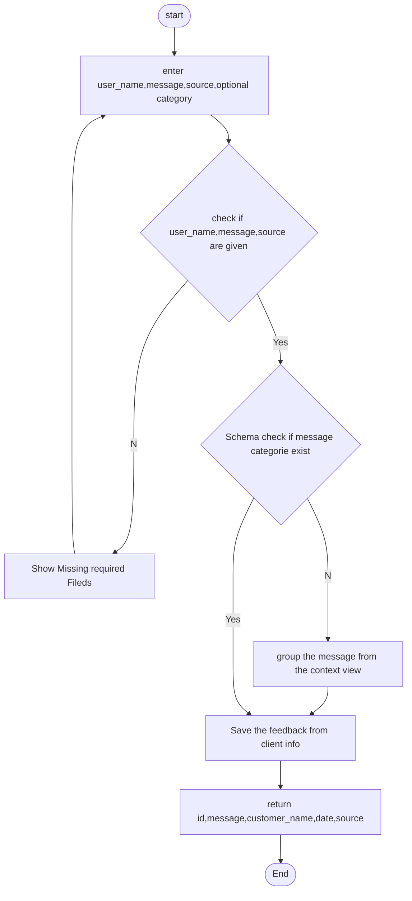
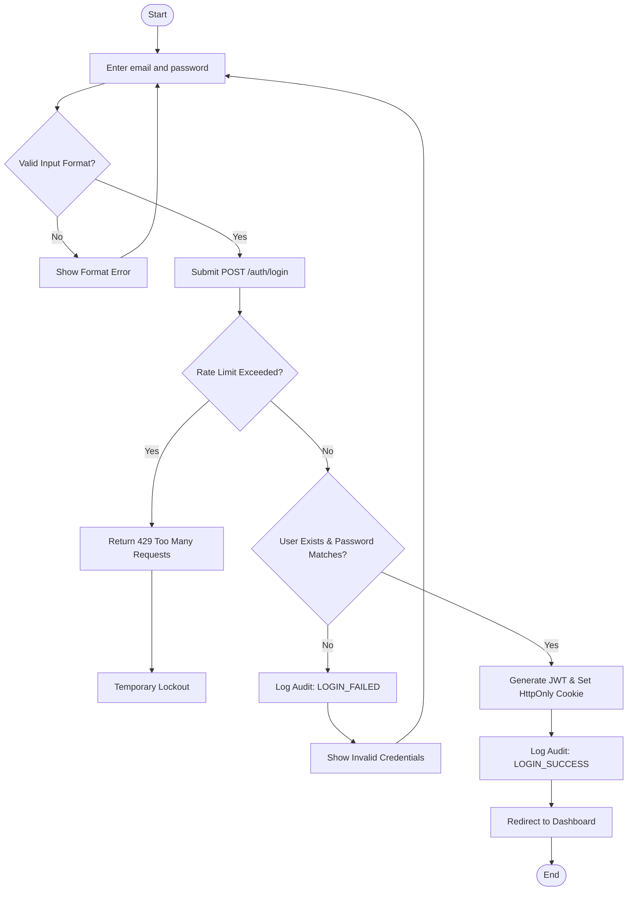
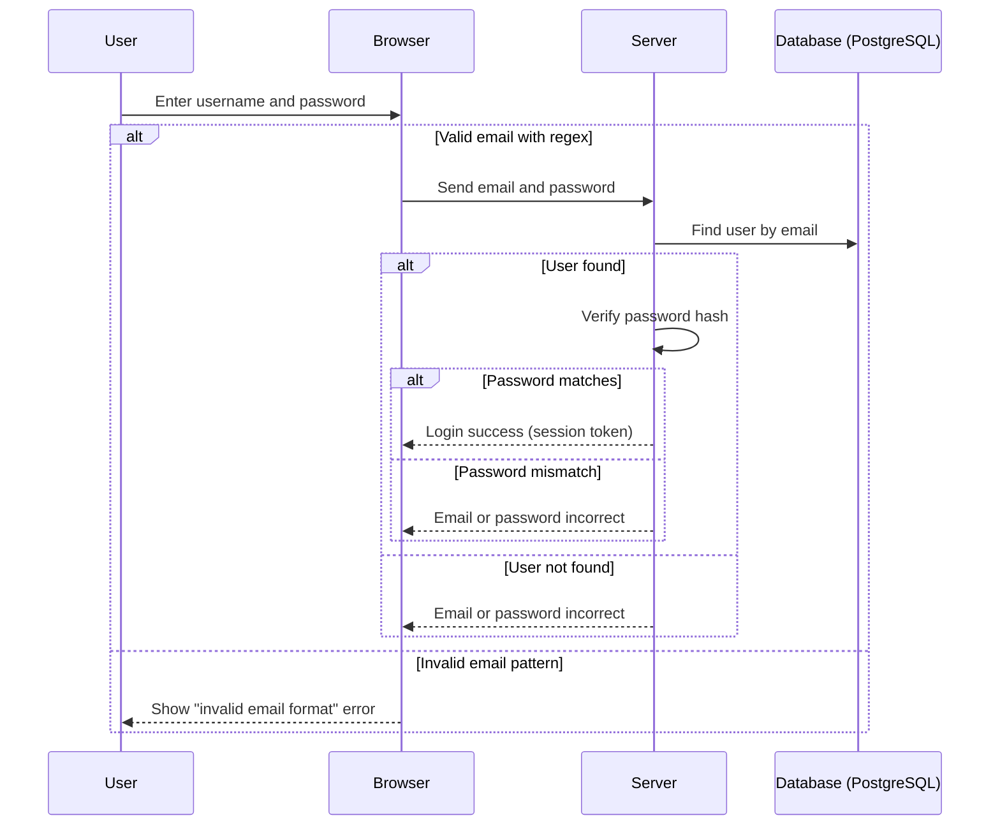

## Send feedback flow chart

```mermaid
flowchart TD
    Start([start])-->Input[enter user_name,message,source,optional category]
    Input-->Validate{check if user_name,message,source are given}
    Validate--No-->ErrorMessage[Show Missing required Fileds]
    ErrorMessage-->Input
    Validate--Yes-->CheckCategories{"Schema check if message categorie exist"}
    CheckCategories--No-->NLPService[group the message from the context view]
    NLPService-->Crud[Save feedback]
    CheckCategories--Yes-->Crud[Save the feedback from client info]
    Crud-->Return[ return id,message,customer_name,date,source]
    Return-->End([End])

```

## Login flow chart

```mermaid
flowchart TD
    Start([Start])-->Input[Enter email and password]
    Input --> Validate{Valid Input Format?}
    
    Validate -- No --> ErrFormat[Show Format Error]
    ErrFormat --> Input
    
    Validate -- Yes --> Submit[Submit POST /auth/login]
    Submit --> RateCheck{Rate Limit Exceeded?}
    
    RateCheck -- Yes --> ErrRate[Return 429 Too Many Requests]
    ErrRate --> Lockout[Temporary Lockout]
    
    RateCheck -- No --> DBCheck{User Exists & Password Matches?}
    
    DBCheck -- No --> AuditFail[Log Audit: LOGIN_FAILED]
    AuditFail --> ErrAuth[Show Invalid Credentials]
    ErrAuth --> Input
    
    DBCheck -- Yes --> GenCookie[Generate JWT & Set HttpOnly Cookie]
    GenCookie --> AuditSuccess[Log Audit: LOGIN_SUCCESS]
    AuditSuccess --> Redirect[Redirect to Dashboard]
    Redirect --> End([End])
```

## Sequence diagram

```mermaid
sequenceDiagram
    participant U as User
    participant B as Browser
    participant S as Server
    participant D as Database (PostgreSQL)

    U->>B: Enter username and password
    alt Valid email with regex
        B->>S: Send email and password
        S->>D: Find user by email
        alt User found
            S->>S: Verify password hash
            alt Password matches
                S-->>B: Login success (session token)
            else Password mismatch
                S-->>B: Email or password incorrect
            end
        else User not found
            S-->>B: Email or password incorrect
        end
    else Invalid email pattern
        B-->>U: Show "invalid email format" error
    end
```