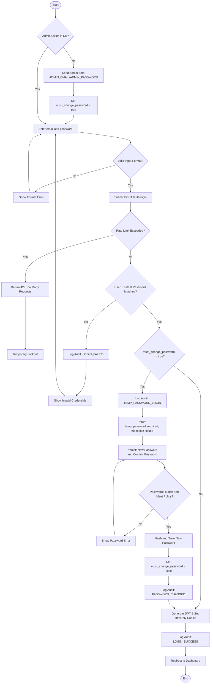
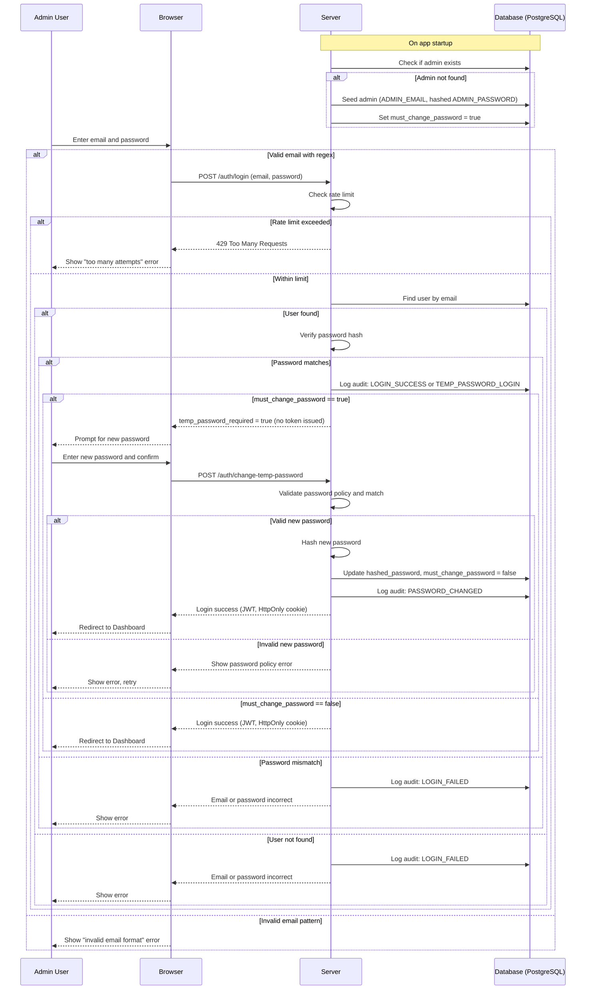

## Send feedback flow chart

```mermaid
flowchart TD
    Start([start])-->Input[enter user_name,message,source,optional category]
    Input-->Validate{check if user_name,message,source are given}
    Validate--No-->ErrorMessage[Show Missing required Fileds]
    ErrorMessage-->Input
    Validate--Yes-->CheckCategories{"Schema check if message categorie exist"}
    CheckCategories--No-->NLPService[group the message from the context view]
    NLPService-->Crud[Save feedback]
    CheckCategories--Yes-->Crud[Save the feedback from client info]
    Crud-->Return[ return id,message,customer_name,date,source]
    Return-->End([End])
```

## Admin First-Login & Temporary Password Flow

```mermaid
flowchart TD
    Start([Start]) --> SeedCheck{Admin Exists in DB?}
    SeedCheck -- No --> SeedAdmin[Seed Admin from ADMIN_EMAIL/ADMIN_PASSWORD]
    SeedAdmin --> SetFlag[Set must_change_password = true]
    SetFlag --> Input

    SeedCheck -- Yes --> Input[Enter email and password]
    Input --> Validate{Valid Input Format?}

    Validate -- No --> ErrFormat[Show Format Error]
    ErrFormat --> Input

    Validate -- Yes --> Submit[Submit POST /auth/login]
    Submit --> RateCheck{Rate Limit Exceeded?}

    RateCheck -- Yes --> ErrRate[Return 429 Too Many Requests]
    ErrRate --> Lockout[Temporary Lockout]

    RateCheck -- No --> DBCheck{User Exists & Password Matches?}

    DBCheck -- No --> AuditFail[Log Audit: LOGIN_FAILED]
    AuditFail --> ErrAuth[Show Invalid Credentials]
    ErrAuth --> Input

    DBCheck -- Yes --> CheckTemp{must_change_password == true?}

    CheckTemp -- No --> GenCookie[Generate JWT & Set HttpOnly Cookie]
    GenCookie --> AuditSuccess[Log Audit: LOGIN_SUCCESS]
    AuditSuccess --> Redirect[Redirect to Dashboard]
    Redirect --> End([End])

    CheckTemp -- Yes --> AuditTemp[Log Audit: TEMP_PASSWORD_LOGIN]
    AuditTemp --> ForcePrompt[Return temp_password_required, no cookie issued]
    ForcePrompt --> NewPasswordForm[Prompt: New Password and Confirm Password]
    NewPasswordForm --> ValidatePw{Passwords Match and Meet Policy?}

    ValidatePw -- No --> PwError[Show Password Error]
    PwError --> NewPasswordForm

    ValidatePw -- Yes --> UpdatePw[Hash and Save New Password]
    UpdatePw --> ClearFlag[Set must_change_password = false]
    ClearFlag --> AuditChange[Log Audit: PASSWORD_CHANGED]
    AuditChange --> GenCookie
```

## Admin First-Login & Temporary Password Sequence Diagram

```mermaid
sequenceDiagram
    participant U as Admin User
    participant B as Browser
    participant S as Server
    participant D as Database (PostgreSQL)

    Note over S,D: On app startup
    S->>D: Check if admin exists
    alt Admin not found
        S->>D: Seed admin (ADMIN_EMAIL, hashed ADMIN_PASSWORD)
        S->>D: Set must_change_password = true
    end

    U->>B: Enter email and password
    alt Valid email with regex
        B->>S: POST /auth/login (email, password)
        S->>S: Check rate limit
        alt Rate limit exceeded
            S-->>B: 429 Too Many Requests
            B-->>U: Show "too many attempts" error
        else Within limit
            S->>D: Find user by email
            alt User found
                S->>S: Verify password hash
                alt Password matches
                    S->>D: Log audit: LOGIN_SUCCESS or TEMP_PASSWORD_LOGIN
                    alt must_change_password == true
                        S-->>B: temp_password_required = true (no token issued)
                        B-->>U: Prompt for new password
                        U->>B: Enter new password and confirm
                        B->>S: POST /auth/change-temp-password
                        S->>S: Validate password policy and match
                        alt Valid new password
                            S->>S: Hash new password
                            S->>D: Update hashed_password, must_change_password = false
                            S->>D: Log audit: PASSWORD_CHANGED
                            S-->>B: Login success (JWT, HttpOnly cookie)
                            B-->>U: Redirect to Dashboard
                        else Invalid new password
                            S-->>B: Show password policy error
                            B-->>U: Show error, retry
                        end
                    else must_change_password == false
                        S-->>B: Login success (JWT, HttpOnly cookie)
                        B-->>U: Redirect to Dashboard
                    end
                else Password mismatch
                    S->>D: Log audit: LOGIN_FAILED
                    S-->>B: Email or password incorrect
                    B-->>U: Show error
                end
            else User not found
                S->>D: Log audit: LOGIN_FAILED
                S-->>B: Email or password incorrect
                B-->>U: Show error
            end
        end
    else Invalid email pattern
        B-->>U: Show "invalid email format" error
    end
```
